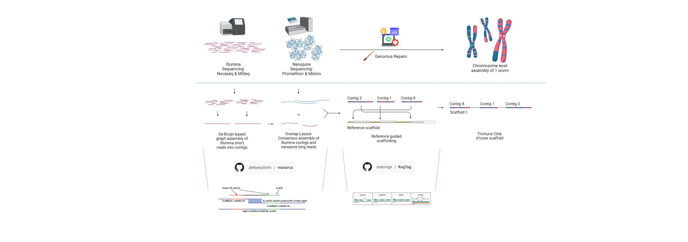
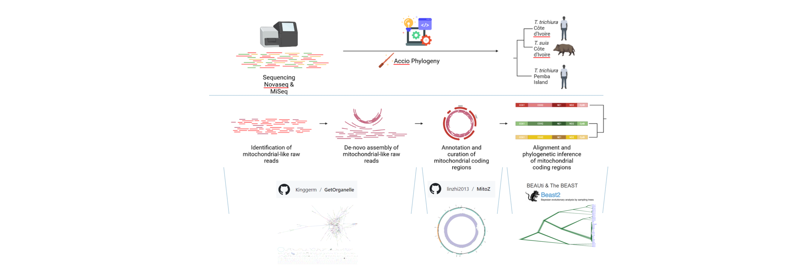

# Genetic makeup of a *Trichuris* species, not responding to drug treatment in Côte d’Ivoire and potential drug targets from comparative genomic analyses

Author: Max Bär, max.baer[at]swisstph.ch

## Contents:
This repository contains all code to reproduce the results and figures from the publication [Genetic makeup of a *Trichuris* species, not responding to drug treatment in Côte d’Ivoire and potential drug targets from comparative genomic analyses]().
3 pipelines are presented, for the de-novo hybrid genome assembly, for the gene prediction and functional annotation of the 
newly assembly genome and for the assembly and phylogenetic inference of approx. 700 individual mitogenomes of *T. resilentia*. Nextflow was the main language used
to construct the pipelines and each code snippet is elaborated on in the respective README.md file in the sub-directories. All scripts were run on the SciCORE computing cluster at the University of Basel with most modules pre-installed.
Many scripts were adapted from Stephen Doyle's project on ancient and modern *Trichuris* genomes ([Population genomics of ancient and modern Trichuris trichiura](https://github.com/stephenrdoyle/ancient_trichuris/tree/master))
 

Table of contents

1. [De-novo hybrid genome assembly](https://github.com/max-baer/Trichuris_Resilentia/tree/master/01_De-novo_hybrid_assembly)
2. [Gene prediction and funtional annotation](https://github.com/max-baer/Trichuris_Resilentia/tree/master/02_De-novo_annotation_pipeline) 
3. [Mitogenome assembly and phylogeny](https://github.com/max-baer/Trichuris_Resilentia/tree/master/03_Mitogenome_assembly_and_phylogeny) 
___
## De-novo hybrid genome assembly 
### Visual overview

### Methods
Nextflow (version 23.04.1 build 5866) was used with Java (version 11.0.3). Nanopore raw reads were channeled into 
[chopper (version 0.6.0)](https://academic.oup.com/bioinformatics/article/39/5/btad311/7160911?login=true) 
where [reads below 5kb](https://royalsocietypublishing.org/doi/10.1098/rstb.2020.0160) and low quality reads
were filtered out and adapters trimmed. Trimmed reads were channeled into 
[Kraken2 (version 2.1.1)](https://genomebiology.biomedcentral.com/articles/10.1186/s13059-019-1891-0) 
and reads with a contamination ratio >0.5 were filtered out with a custom R (version 4.3.0) script.
Illumina reads were channeled into Kraken2 where reads of impurities were identified and filtered out. 
Illumina and Nanopore channels were combined to run a hybrid de-novo genome assembly using 
[MaSuRCA (version 4.0.9)](https://academic.oup.com/bioinformatics/article/29/21/2669/195975). 
The outputted contigs were channeled into
[RagTag (version 2.1.0)](https://genomebiology.biomedcentral.com/articles/10.1186/s13059-022-02823-7) for correction and 
scaffolding using the Trichuris trichiura (PRJEB535) reference genome. The corrected scaffolds were then
assigned to one of three linkage groups from T. Muris using 
[Liftoff (version 1.6.3)](https://academic.oup.com/bioinformatics/article/37/12/1639/6035128?login=true), 
as described in [literature](https://www.nature.com/articles/s41467-022-31487-x#Sec8). 
The genome was frozen for quality assessment using
[BUSCO (version 5.1.2 with Metazoa_obd10 database)](https://academic.oup.com/mbe/article/38/10/4647/6329644) 
and [QUAST (version 5.0.2)](https://academic.oup.com/bioinformatics/article/34/13/i142/5045727?login=true). 
## Gene prediction and funtional annotation 
### Methods
Nextflow (version 23.04.1 build 5866) was used with Java (version 11.0.3). All available reference whole genomes of 
Trichuris species and Trichinella spiralis were channeled into the pipeline containing the newly assembled genome
of *T. resilentia* to run a de-novo gene prediction on all reference genomes and reduce methodological
bias from gene prediction software. Repeat regions were masked using RepeatMasker (version 4.1.4) before channeling the
genome to [BRAKER (version 3.0.6, Braker2 pipeline using the Metazoa protein database from OrthoDB 11)](https://academic.oup.com/nargab/article/3/1/lqaa108/6066535).
Gene prediction statistics including exon and intron count, mean length and median length were gathered using a custom bash script. 
## Mitogenome assembly and phylogeny 
### Visual overview

### Methods
For all sequencing, assembly and annotation pipelines Nextflow (version 23.04.1 build 5866) 
was used with Java (version 11.0.3). Raw reads were first processed using [Trimmomatic (version 0.39)](https://www.ncbi.nlm.nih.gov/pmc/articles/PMC4103590/) 
; for PE reads, adapters were removed and N-bases trimmed. Next reads were channeled to [getorganelle (version 1.7.7.0)](https://genomebiology.biomedcentral.com/articles/10.1186/s13059-020-02154-5) 
to reconstruct the mitochondrial genome. Runs which resulted in a complete mitochondrial genome were further processed by 
flipping in cases where the reverse complement was generated and adjustment to COX1 as starting gene. Reference and newly 
constructed mitochondrial genomes were annotated and visualized using [MitoZ (version 3.6)](https://academic.oup.com/nar/article/47/11/e63/5377471?login=true). 
Coding genes were then extracted and aligned as amino acid and nucleic acid sequences using [MAFFT (version 7.490)](https://academic.oup.com/mbe/article/30/4/772/1073398).

[BEAST2 (version 2.7.5)](https://journals.plos.org/ploscompbiol/article?id=10.1371/journal.pcbi.1006650) was used for all phylogenetic inference with a pure birth process (Yule process). 
Aligned concatenated nucleic acid sequences from all assembled and reference mitochondrial genomes were 
treated as homochromous. The JC69 substitution model with gamma-distributed rate heterogeneity was used 
(JC69 + Γ4) and a strict molecular clock was assumed. Trees and clock models were linked and all model 
parameters were estimated jointly. A Markov Chain Monte Carlo was run for each analysis. Tracer 
(version 1.7.2) was used to assess convergence and effective sample size (should be over 200).
The percentage of samples discarded as burn-in was at least 10%. For the amino acid inferred species tree,
2 assembled sequences of each subclade clade with a posterior distribution over 0.95 were selected at random.
The mito REV substitution model was used and all genes were partitioned separately, allowing for different 
rates for each gene. Effective sample size (ESS) was at least 900 for each of the inferred parameters. The 
intraspecies phylogeny was inferred using a TN96 + Γ4 model. Each gene was partitioned separately and codon 
positions 1 and 2 were partitioned separately to 3. 